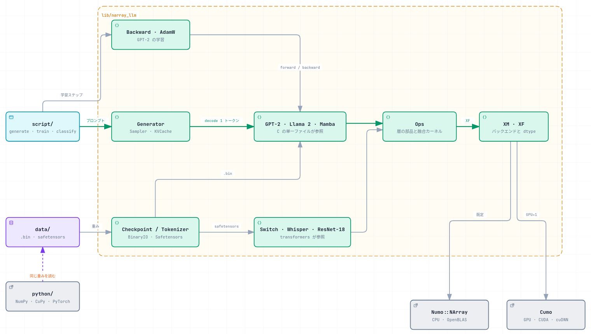

# narray-llm

6 モデル (+ Llama 2 の int8) の推論と GPT-2 124M の学習を [Numo::NArray](https://github.com/ruby-numo/numo-narray) / [Cumo](https://github.com/sonots/cumo) だけで実装するプロジェクト。深層学習フレームワークは使わない。

重みと参照値は [llm.c](https://github.com/karpathy/llm.c) と [llama2.c](https://github.com/karpathy/llama2.c) のものをそのまま使い、各段階の関門を参照実装とのトークン列の完全一致に置く。学習だけは完全一致にできないので、そこは llm.c 自身の許容誤差を借りている (下記)。同じコードが `XM` 定数の差し替えだけで CPU (Numo) と GPU (Cumo) の両方で動く。

<picture>
  <source media="(prefers-color-scheme: dark)" srcset="docs/architecture-dark.png">
  
</picture>

## In English

narray-llm implements six models in Ruby: GPT-2 124M, Llama 2 110M (also with int8 weights), Mamba 130M, Switch Transformer base-8, Whisper tiny and ResNet-18. It also trains GPT-2 124M with AdamW. It uses only Numo::NArray on the CPU and Cumo on the GPU, with no deep learning framework. The same code runs on both backends.

Each model must match its reference implementation exactly. For the language models, that means the same token sequence as llm.c, llama2.c, mamba.c or transformers. Training uses the tolerances of llm.c itself.

The tables below compare Cumo with CuPy and PyTorch ports of the same models. They were measured on an RTX 5070 Ti Laptop GPU with locked clocks. In one-token decode, Cumo is 3.1 to 3.5 times as fast as CuPy and 1.02 to 1.35 times as fast as PyTorch. Where matrix multiplication dominates (generation without a KV cache, encoders), Cumo runs at 0.87 to 1.02 times the speed of PyTorch. With int8 weights, it is 2.7 times as fast as PyTorch. PyTorch is faster on ResNet-18 and on training, where Cumo reaches 0.60 times its speed.

The project exists to exercise Numo and Cumo on real workloads. Several performance problems found here have been fixed in Cumo itself. The measurement notes under docs/results/ are in Japanese.

## 数字

要約すると、1 トークンずつ生成する decode では Cumo が CuPy の 3.1〜3.5 倍、PyTorch の 1.02〜1.35 倍速い。行列積が支配する条件 (KV キャッシュ無しの生成、encode) では PyTorch の 0.87〜1.02 倍で、並ぶか少し負ける。int8 では PyTorch の 2.7 倍。ResNet-18 と学習は PyTorch が速く、学習は 0.60 倍。

同じ重み・同じ手順で Python の 3 実装と並べたもの。5 実装すべてが同一のトークン列を出すことを関門にしてある。

tokens/sec、プロセスごとに best-of-3 の中央値、11 ラウンドの先頭を位置で捨てて 10。Cumo / CuPy / PyTorch / 対照 (Cumo をもう一度) の 4 系列を 1 ラウンド内でインターリーブし、系列の順序をラウンドごとに回転させて直列に走らせた。クロックは `nvidia-smi -lgc 3090` / `-lmc 14001` で固定してある。GPU は RTX 5070 Ti Laptop。この表は 2026-09-22 に cumo 0.10.0 で測り直したもので、18 条件すべてで対照が 1 をまたいでいる。

比は同じラウンドどうしの比の中央値で、分子はすべて Cumo。1 を超えれば Cumo が速い。後ろの n/10 は、10 ラウンドのうち比が 1 を超えた (Cumo が速かった) 回数。

### GPT-2 124M

tokens/sec (1 秒あたりに生成したトークン数)。大きいほど速い。

| KV キャッシュ | 生成長 | Cumo | CuPy | PyTorch | Cumo / CuPy | Cumo / PyTorch |
|---|---|---|---|---|---|---|
| 有り | 64 | 812.4 | 230.5 | 795.2 | 3.529 10/10 | 1.023 10/10 |
| 有り | 256 | 777.0 | 228.2 | 709.0 | 3.405 10/10 | 1.096 10/10 |
| 無し | 64 | 472.6 | 208.8 | 494.3 | 2.266 10/10 | 0.954 0/10 |
| 無し | 256 | 216.2 | 142.3 | 241.4 | 1.520 10/10 | 0.896 0/10 |

バッチ生成 (KV キャッシュ有り、長さ 256)。tokens/sec は全系列の合計で、大きいほど速い。

| batch | Cumo | CuPy | PyTorch | Cumo / CuPy | Cumo / PyTorch |
|---|---|---|---|---|---|
| 1 | 785.9 | 225.2 | 708.0 | 3.497 10/10 | 1.111 10/10 |
| 8 | 3824.4 | 1712.2 | 3613.3 | 2.227 10/10 | 1.061 10/10 |

経過と内訳は [gpt2-124m.md](docs/results/gpt2-124m.md)。

### Llama 2 110M (stories110M)

tokens/sec (1 秒あたりに生成したトークン数)。大きいほど速い。

| KV キャッシュ | 生成長 | Cumo | CuPy | PyTorch | Cumo / CuPy | Cumo / PyTorch |
|---|---|---|---|---|---|---|
| 有り | 64 | 723.7 | 217.5 | 535.2 | 3.331 10/10 | 1.293 10/10 |
| 有り | 200 | 722.3 | 218.4 | 553.7 | 3.270 10/10 | 1.291 10/10 |
| 無し | 64 | 465.7 | 203.0 | 456.0 | 2.294 10/10 | 1.024 10/10 |
| 無し | 200 | 253.4 | 172.9 | 263.9 | 1.465 10/10 | 0.957 0/10 |

キャッシュ有りの 2 行は幅が 20% ある (2 群に分かれ、中央値は高いほうの群。未分離)。経過と内訳は [llama2-110m.md](docs/results/llama2-110m.md)。

### Llama 2 110M を int8 (Q8_0) で

キャッシュ有りのみ。全実装が一致するのは 131 トークンまで。この表だけ 0.10.0 で測り直しておらず別のバッチなので、ほかの表とまたいで比を取らないこと。

tokens/sec (1 秒あたりに生成したトークン数)。大きいほど速い。

| 生成長 | Cumo | CuPy | PyTorch | Cumo / CuPy | Cumo / PyTorch |
|---|---|---|---|---|---|
| 64 | 410.71 | 62.17 | 152.57 | 6.582 10/10 | 2.687 10/10 |
| 128 | 411.98 | 62.37 | 152.75 | 6.602 10/10 | 2.731 10/10 |

経過と内訳は [llama2-int8.md](docs/results/llama2-int8.md)。

### Mamba 130M

tokens/sec (1 秒あたりに生成したトークン数)。大きいほど速い。

| 生成長 | Cumo | CuPy | PyTorch | Cumo / CuPy | Cumo / PyTorch |
|---|---|---|---|---|---|
| 64 | 465.5 | 150.5 | 359.1 | 3.087 10/10 | 1.292 10/10 |
| 200 | 501.7 | 147.8 | 371.3 | 3.429 10/10 | 1.351 10/10 |

1 トークン 629 本の時点の表。経過と内訳は [mamba-130m.md](docs/results/mamba-130m.md)。

### Switch Transformer base-8 (MoE)

tokens/sec。decode は 1 秒あたりに生成したトークン数、encode は 1 秒あたりに encoder を通した入力トークン数。大きいほど速い。

| 条件 | Cumo | CuPy | PyTorch | Cumo / CuPy | Cumo / PyTorch |
|---|---|---|---|---|---|
| decode 72 トークン | 155.8 | 50.1 | 144.9 | 3.127 10/10 | 1.081 10/10 |
| encode 2048 トークン | 2831.1 | 2732.2 | 2810.5 | 1.036 9/10 またぐ | 1.006 6/10 またぐ |

経過と内訳は [switch-base-8.md](docs/results/switch-base-8.md)。

### Whisper tiny (音声)

decode は 1 秒あたりに生成したトークン数、encode は 1 秒あたりに encoder を通した音声フレームの位置数 (30 秒の音声が 1500 位置)。大きいほど速い。

| 条件 | Cumo | CuPy | PyTorch | Cumo / CuPy | Cumo / PyTorch |
|---|---|---|---|---|---|
| decode (tokens/sec) | 756.1 | 231.9 | 716.7 | 3.266 10/10 | 1.058 10/10 |
| encode (positions/sec) | 228,269 | 179,117 | 262,905 | 1.273 10/10 | 0.869 0/10 |

メル (3000 フレーム) はこのバッチに入れていない。経過と内訳は [whisper-tiny.md](docs/results/whisper-tiny.md)。

### ResNet-18 (2 次元の畳み込み)

枚/sec (1 秒あたりに分類した画像の枚数)。大きいほど速い。カーネル/pass は 1 回の forward で GPU に投入するカーネルの本数。

| 綴り | Cumo | CuPy | Cumo / CuPy | カーネル/pass (Cumo) |
|---|---|---|---|---|
| `shift` | 625.0 | 430.2 | 1.452 10/10 | 526 |
| `unfold` | 922.1 | 993.8 | 0.929 0/10 | 330 |
| 綴りの効き (`unfold` / `shift`) | 1.48 倍 | 2.31 倍 | | |
| 対照 (Cumo `unfold` をもう一度) | 923.0 | | またぐ | |

cuDNN の腕は別のバッチなので、上の表とまたいで比を取らないこと。CuPy 14.2 は cuDNN の畳み込みを公開していないので、この表の相手は PyTorch。単位は同じく枚/sec。

| 条件 | 枚/sec | カーネル/pass | |
|---|---|---|---|
| Cumo `unfold` | 919.7 | 330 | |
| Cumo `cudnn` (既定 8 MiB) | 1238.0 | 99 | `unfold` の 1.35 倍 |
| Cumo `cudnn` (1 GiB、TF32 あり) | 2008.7 | 183 | `unfold` の 2.18 倍 |
| PyTorch (fp32) | 2291.7 | | |
| PyTorch (TF32、既定) | 2805.7 | | Cumo (1 GiB) の 1.40 倍 |
| 対照 (Cumo `cudnn` 既定) | 1237.5 | | またぐ |

経過と内訳は [resnet-18.md](docs/results/resnet-18.md)。

### サンプリング (温度 / top-k / top-p)

GPT-2 124M の decode。上の 3 行は 1 トークンあたりに GPU に投入するカーネルの本数 (少ないほど軽い)、tokens/sec は大きいほど速い。最後の行は tokens/sec の比で、1 を超えるほどその条件が遅い。

| 1 トークンあたり | 貪欲法 | top_k 50 | top_p 0.9 | 両方 |
|---|---|---|---|---|
| `sort` (コピー込み) | 0 | 8 | 8 | 8 |
| `cumsum` (CUB) | 0 | 2 | 4 | 4 |
| カーネル合計 | 234 | 262 | 276 | 281 |
| tokens/sec (長さ 900) | 646.4 | 627.1 | 609.6 | 606.1 |
| 貪欲法 / この条件 | — | 1.0367 またぐ | 1.0637 10/10 | 1.0692 10/10 |

経過と内訳は [gpt2-124m.md](docs/results/gpt2-124m.md)。

### GPT-2 124M の学習 (backward + AdamW)

関門は llm.c の `test_gpt2.c` の許容誤差 (勾配 2e-2、損失 1e-2)。表の値は llm.c の参照値との差の最大で、小さいほど参照に近い。

| | 勾配の最大 max\|d\| (関門 B) | 10 ステップの最大 \|d\| (関門 C) |
|---|---|---|
| Numo (CPU) | 1.244e-02 | 1.48e-03 |
| Cumo (GPU) | 6.822e-04 | 1.37e-04 |

Cumo と PyTorch を同じバッチでインターリーブした区間別 (11 ラウンドの先頭を位置で捨てて 10 ラウンド、対照つき)。1 秒あたりにその区間を通せる回数で、合計の行が steps/sec。大きいほど速い。本/step は 1 ステップで GPU に投入するカーネルの本数。測った s/step の逆数で、比も時間の比の逆数から出している。

| 区間 | 本/step | Cumo | PyTorch | Cumo / PyTorch |
|---|---|---|---|---|
| forward | 331 | 104.8 | 126.3 | 0.83 0/10 (幅が 17.2% で値は読めない) |
| backward | 1755 | 34.0 | 55.4 | 0.61 0/10 |
| update (AdamW) | 2861 | 26.5 | 50.0 | 0.53 0/10 |
| 合計 | 4947 | 13.0 | 21.7 | 0.60 0/10 |

経過と内訳は [gpt2-124m.md](docs/results/gpt2-124m.md)。

### 1 トークンあたりのカーネル数

decode で 1 トークンあたりに GPU に投入するカーネルの本数 (nsys、`--length 128` と `--length 64` の差 ÷ 64)。少ないほど起動の費用が小さい。

| | 当初 | 現在 | PyTorch (参考) |
|---|---|---|---|
| GPT-2 124M | 640 | 210 | 196 (fp32) / 148 (fp16) |
| Llama 2 110M | 891 | 342 | — |
| Mamba 130M | 1115 | 629 | 1302 |
| Switch base-8 | 2637 | 1821 | — |
| Whisper tiny | — | 341 | — |

計測の作法そのものは [AGENTS.md](AGENTS.md) に、その則がどの測定から来たかは [docs/measurement-cases.md](docs/measurement-cases.md) にある。

条件・手順・外れ値の扱い・そこに至る過程はすべて [docs/results/](docs/results/) にある。[gpt2-124m.md](docs/results/gpt2-124m.md)、[llama2-110m.md](docs/results/llama2-110m.md)、[mamba-130m.md](docs/results/mamba-130m.md)、[switch-base-8.md](docs/results/switch-base-8.md)、[whisper-tiny.md](docs/results/whisper-tiny.md)、[llama2-int8.md](docs/results/llama2-int8.md)、[resnet-18.md](docs/results/resnet-18.md) がモデルごとの記録で、採用しなかった変更とその理由も同じ場所に残してある。

## 計測環境

2026-09-23 時点の開発機。上の表を測ったときの cumo はリリース版の 0.10.0 で、いま入っているのは master (`ba27577a`) を `rake install:local` で入れたもの (`Cumo::VERSION` は同じ 0.10.0 と出る)。

| | |
|---|---|
| 機体 | ASUS ROG NUC 2025 (`NUC15JNKU9X7`)。ラップトップ GPU を積んだミニ PC |
| CPU | Intel Core Ultra 9 275HX (24 スレッド) |
| メモリ | 62 GiB (`free` の total) |
| GPU | NVIDIA GeForce RTX 5070 Ti Laptop (Blackwell, sm_120)、VRAM 12 GB、電力上限 100 W (最大 140 W) |
| クロック | 計測中は `nvidia-smi -lgc 3090` / `-lmc 14001` で固定 (`clocks.max.sm` 3090 MHz、`clocks.max.mem` 14001 MHz) |
| OS | CachyOS (Linux 7.2.6-1-cachyos) |
| NVIDIA ドライバ | 615.71.09 |
| CUDA | 13.4 (nvcc V13.4.92) |
| cuDNN | 9.26.0 |
| コンパイラ | GCC 16.2.1 |
| Ruby | 4.0.7 |
| Numo | numo-narray-alt 0.11.2、numo-linalg-alt 0.10.1 (同梱の OpenBLAS 0.3.34) |
| Cumo | 0.10.0 (`CUMO_NVCC_GENERATE_CODE=arch=compute_120,code=sm_120` でビルド) |
| Python | 3.14.7、NumPy 2.5.3、CuPy 14.2.0、PyTorch 2.13.0+cu130 (同梱の cuDNN 9.20) |
| プロファイラ | Nsight Systems 2026.3.2 |

GPU の性質 (メモリクロックの段、帯域、電力) は [docs/machine.md](docs/machine.md) にある。同じ表でも段が違えば 1.4 倍動くので、別の機械の数字と並べるときはそちらを先に読むこと。

## 現在の状態

進め方は [PLAN-gpt2.md](docs/plans/PLAN-gpt2.md)、[PLAN-llama2.md](docs/plans/PLAN-llama2.md)、[PLAN-mamba.md](docs/plans/PLAN-mamba.md)、[PLAN-switch.md](docs/plans/PLAN-switch.md)、[PLAN-whisper.md](docs/plans/PLAN-whisper.md)、[PLAN-batch.md](docs/plans/PLAN-batch.md)、[PLAN-sampling.md](docs/plans/PLAN-sampling.md)、[PLAN-training.md](docs/plans/PLAN-training.md)、[PLAN-conv2d.md](docs/plans/PLAN-conv2d.md) に従い、前の段階の受け入れテストが通るまで次の段階のコードは書かない。

| モデル | 段階 | 状態 |
|---|---|---|
| GPT-2 124M | 重みの読み込み / フォワード / 生成 / KV キャッシュ | 完了 (Numo と Cumo が llm.c と同一のトークン列) |
| Llama 2 110M | 同上 | 完了 (Numo と Cumo が llama2.c と同一のトークン列) |
| Llama 2 110M (int8) | decode のみ | 完了 (Numo と Cumo が一致、runq.c と 131 トークン一致) |
| Mamba 130M | 重みの読み込み / フォワード / 生成 | 完了 (Numo と Cumo が mamba.c と同一のトークン列) |
| Switch base-8 (MoE) | 重みの読み込み / encoder / decoder と生成 / 計測 | 完了 (Numo と Cumo が transformers と同一のトークン列。C 参照が無いので関門を作り直した) |
| Whisper tiny (音声) | 重みの読み込み / encoder / decoder と生成 / メル / 計測 / 3 実装の比較 | 完了 (同上。畳み込みとメルスペクトログラムが新しい) |
| GPT-2 124M (学習) | 勾配リーダ / op ごとの backward / モデル全体の backward / AdamW / 計測 | 完了 (Numo と Cumo が llm.c の関門 B・C を通る。完全一致ではなく llm.c の許容誤差) |
| ResNet-18 (2 次元の畳み込み) | 重みと参照 / Conv2d / pooling とブロック / モデル全体 / 計測 | 完了 (16 枚のクラス番号が transformers と完全一致。生成しないモデルなので関門が違う) |

次に何を作るかの候補は [docs/idea.md](docs/idea.md) にある。モデルとは限らない — バッチ生成のように、既にあるモデルへ足すほうが安く広く踏めることもある。

## 動かす

```
bundle install
rake download                                 # 6 モデルの重みとトークナイザ (Ruby と curl だけで済む)
rake prepare                                  # 変換と参照値まで作り、テストが読むものを全部揃える

rake test                                     # Numo (CPU)
GPU=1 rake test                               # Cumo (GPU)

ruby script/gpt2_generate.rb --length 256          # GPT-2、EOT 1 個から貪欲法で生成
GPU=1 ruby script/llama2_generate.rb stories110M --length 200
GPU=1 ruby script/llama2_generate.rb stories110M_q80 --length 128   # int8
GPU=1 ruby script/mamba_generate.rb --length 256

GPU=1 ruby script/gpt2_train.rb                    # GPT-2 を AdamW で 10 ステップ
GPU=1 ruby script/resnet_classify.rb --spelling cudnn   # ResNet-18 で 16 枚を分類
```

`rake prepare` は Python と C コンパイラを使う。Mamba と Switch は配布された重みを変換し、Llama 2 と Mamba の参照値は C の参照実装から、Switch・Whisper・ResNet-18 の参照値は transformers から取る。Python は `python/.venv` を見る (`PYTHON=...` で差し替えられる) ので、先に `python/requirements.txt` を入れておく (torch だけは CUDA の版に合わせて別に入れる。手順はファイルの中にある)。揃ったものは作り直さないので何度叩いてもよく、`rake prepare:switch` のようにモデルごとにも呼べる。data/ は全部で約 7 GB になる。

ResNet-18 で cuDNN を使うなら、cumo 0.9.0 まではワークスペースの上限を上げる (`CUMO_CUDNN_MAX_WORKSPACE_SIZE=268435456`)。既定の 8 MiB では良いアルゴリズムが探索の候補に入らず、上げると 1.50 倍になる。cumo の HEAD では既定 128 MiB なので、何も立てなくてよい ([resnet-18.md](docs/results/resnet-18.md))。

BPE エンコーダは実装していないので、プロンプトはトークン id で渡す (`--tokens 15496,11,995`)。温度・top-k・top-p も入っている (`--top-k 50 --top-p 0.9 --seed 42`)。乱数はホストの `Random` から引くので、両バックエンドが同じ列を出す。

必要なものは Ruby (4.0.7 で検証)、`numo-narray-alt`、`numo-linalg-alt` (無くても動くが同じ GEMM が 27 倍遅くなる)、`test-unit`、`rake`。GPU で動かすなら `cumo` を別途入れる (CUDA toolkit が要るので Gemfile ではコメントアウトしてある)。int8 の数字を再現するなら cumo は 0.9.0 以降が要る ([llama2-int8.md](docs/results/llama2-int8.md))。GPU の無い環境でも全テストが通る状態を保っている。

より詳しい使い方、環境変数、内部の約束事は次にある。

| 読みたいもの | 場所 |
|---|---|
| 計測の条件と手順 | [docs/method.md](docs/method.md) |
| この機械の癖 (クロックの段、帯域、nsys) | [docs/machine.md](docs/machine.md) |
| 重み・トークナイザのファイル形式 (出典つき) | [docs/checkpoint-format-gpt2.md](docs/checkpoint-format-gpt2.md)、[docs/tokenizer-format-gpt2.md](docs/tokenizer-format-gpt2.md)、[同 llama2](docs/checkpoint-format-llama2.md) |
| Cumo で踏んだ非互換 | [docs/cumo-issues.md](docs/cumo-issues.md) |
| Numo と Cumo の差異、計測とテストの作法 | [AGENTS.md](AGENTS.md) |

## 構成

```
lib/narray_llm/          共有の部品 (backend / ops / generator / sampler / kv_cache /
                         safetensors / backward / adam_w / profiler) と models/ の 6 モデル
                         (gpt2 / llama2 / mamba / switch / whisper / resnet)
script/                  取得・フォワード比較・生成・学習・分類のランナー
test/                    各段階の受け入れテストと部品のユニットテスト
python/                  NumPy / CuPy / PyTorch の比較実装とベンチのドライバ
docs/                    形式の仕様、計測結果、機械の特性、段階ごとの計画 (plans/)
data/                    取得した重み (.bin と safetensors) の置き場 (git 管理外)
```

コードは `Numo::` / `Cumo::` を直接書かず `XM` 定数を経由し、フォワードパスのテンソルは `XF` 定数で作る。トークン id のように「デバイスに置くと同期を招く」配列は `HM` (常に Numo) 側に固定している。

図の元データは [docs/architecture.archify.json](docs/architecture.archify.json) で、[archify](https://github.com/tt-a1i/archify) が JSON を検証してから PNG に落としている。

## 謝辞

C の単一ファイル参照に依っている。GPT-2 と学習は Andrej Karpathy の [llm.c](https://github.com/karpathy/llm.c)、Llama 2 と int8 は同じく [llama2.c](https://github.com/karpathy/llama2.c) (どちらも MIT)、Mamba は kroggen の [mamba.c](https://github.com/kroggen/mamba.c) (README に MIT と記載)。重み・参照値・ファイル形式をそのまま使い、関門もそれらの出力に置いている。

C 参照が無いモデルは transformers を参照にした。Switch base-8、Whisper tiny、ResNet-18 の 3 つで、中間活性は再実装ではなく実モデルへの forward hook で取っているので、参照が自前の思い込みからずれない。

重みは Hugging Face の配布をそのまま読む — [google/switch-base-8](https://huggingface.co/google/switch-base-8)、[openai/whisper-tiny](https://huggingface.co/openai/whisper-tiny)、[state-spaces/mamba-130m](https://huggingface.co/state-spaces/mamba-130m)、[microsoft/resnet-18](https://huggingface.co/microsoft/resnet-18) (いずれも Apache-2.0)。

ResNet-18 の関門に使う画像は [imagenet-sample-images](https://github.com/EliSchwartz/imagenet-sample-images) から取る。参照を作るときに取得するだけで、このリポジトリには含めていない。

速度の比較対象は CuPy と PyTorch。同じ形の移植を `python/` に置いてあり、どちらも「勝つため」ではなく、出た差が cumo に固有かどうかを分けるために並べている。

そして [Numo::NArray](https://github.com/ruby-numo/numo-narray) と [Cumo](https://github.com/sonots/cumo) — このプロジェクトはそれらを実使用で踏むために書いている。

## ライセンス

コードと文書は [MIT ライセンス](LICENSE)。モデルの重み・参照値・画像はこのリポジトリに含めていないので、取得したものはそれぞれの配布元のライセンスに従う (上の謝辞に挙げたとおり)。llama2.c の `run.c` と mamba.c も取得スクリプトが `vendor/` に置くだけで、追跡していない。
